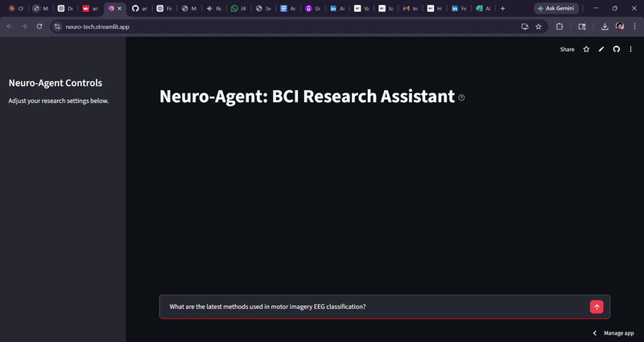

## What is Neuro-Tech?

Neuro-Tech is a neuroscience-based agent that provides vital information
on all topics related to BCI/neuroscience.

## The Problem

Currently, finding good BCI/neuroscience research papers is a pain point.
BCI sits at the intersection of multiple fields, each having its own
conferences.As someone researching the engineering requirements of full neural immersion interfaces, I found existing research too scattered. Instead of manually searching across IEEE, PubMed, and
conference proceedings, Neuro-Tech retrieves and synthesizes relevant
findings in seconds. Neuro-Tech is a one-place platform for all those
research papers, designed to help researchers across the world gather
useful research papers in a single click.

## Tech Stack

- Python, LangChain, Gemini, ChromaDB, SBERT, Streamlit, arXiv API

## Prerequisites

- Python 3.10 or higher
- A Gemini API key from [Google AI Studio](https://aistudio.google.com)

## How to Run

1. Clone this repo from git
2. Navigate to the folder and run `pip install -r requirements.txt`
3. Create a `.env` file in the root directory and add your Gemini API
   key from Google AI Studio
4. Run `streamlit run app.py`

## System Architecture

User query → PaperFetcher retrieves relevant papers from arXiv →
VectorStore chunks and embeds them using SBERT → Retriever fetches
the most relevant chunks → Synthesizer sends them to Gemini for
structured analysis → Output displayed in Streamlit UI.

## Example Output

## Demo

## What I Learned

Developing this project from scratch helped me understand useful concepts
like RAG architecture, MMR retrieval, LangChain and its subsets, and
embeddings. The concepts I once thought were way above my level feel like
interesting tools through which I can develop even more projects. This
project also helped me build a habit of reading popular research papers
on LLMs and their optimization, and find modern LLM architectures that
interest me for future projects.

## Future Improvements

- Implement ReAct (Reasoned Actions) for multi-step reasoning
- Evaluation layer to score retrieval quality
- Persistent vector store across conversation turns
